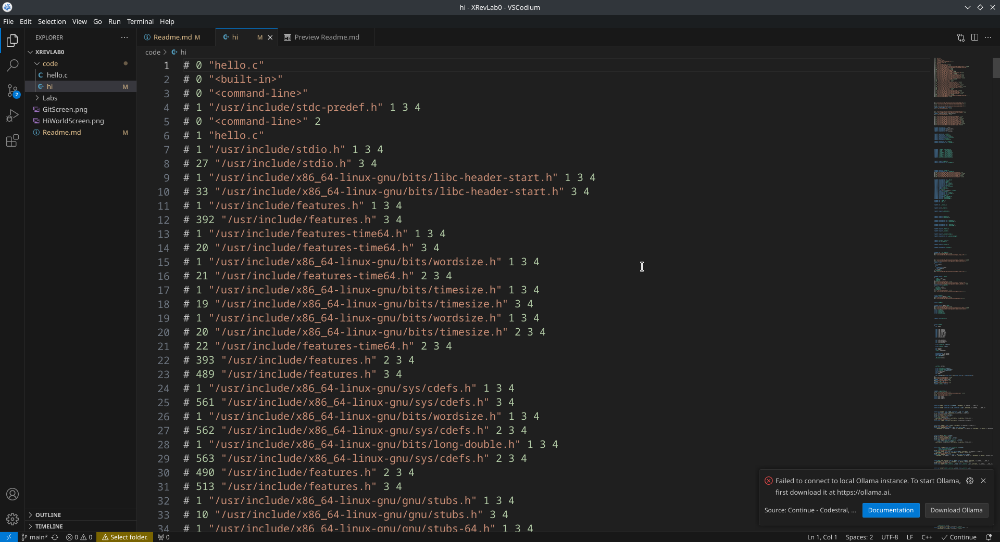
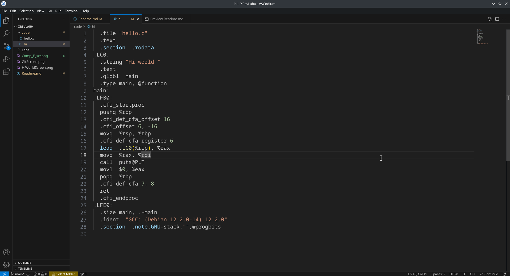
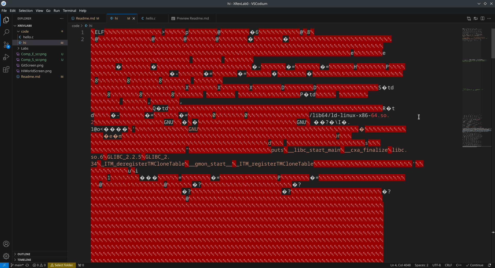
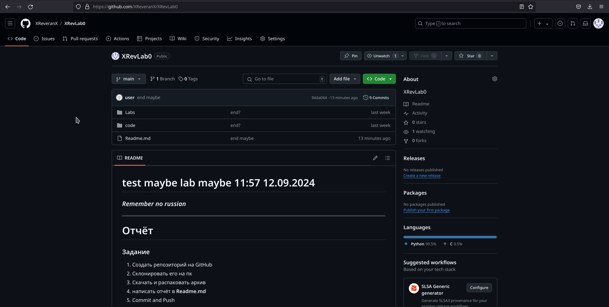
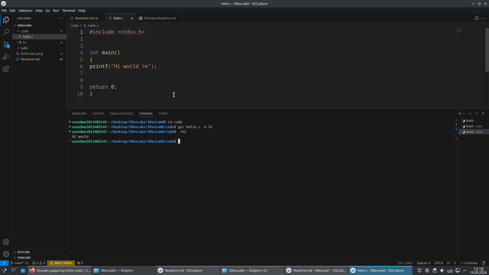

# test maybe lab maybe 11:57 12.09.2024 
### ***Remember no russian***

---
# Отчёт
### Задание
1. Создать репозиторий на GitHub
2. Склонировать его на пк
3. Скачать и распаковать архив
4. написать отчёт в **Readme.md**
5. Commit and Push

### Описание проделанной работы
1. Создал репозиторий на GitHub
2. Создал на GitHub токкен
3. Склонировал репозиторий на пк
2. Скачал и распаковал архив
3. Написал, скомпелировал и запустил программу **Hello.c**
3. Написал отчёт в **Readme.md**
4. Commit and Push

---
# GitHub instruction
### New GitHub repository
1. git init
2. git add ***Name***                (add file to files to push)
3. git commit -m "info"              (create copy of files to push them)
4. git branch -M main                (create new branch)
5. git remote add origin URL         (add URL of your git account)
6. git remote -v                     (check your URL)
7. git push -u origin main           (send files to GitHub)
    1. press accept?                 (it's easy, right?)
    2. OR                            (if accept not apeard)(my **i**nglish is too good)
    3. Username: MyGitExampleName    (username on GitHub(Not Email))
    4. Password: ***Git tokken***    (you have it, right?)(Google how create it, if you don't remember)

### Already have GitHub repository
0. git clone url                     (on new pc)
1. 1. git add ***Name***             (just ***Name*** file)
   2.   git add .                    (all files)
2. git commit -m "***info about changes***"   (***Remember no russian***)
3. git push                          (you now it, right?)(7.x(Up) if you not)
4.  1. press accept?
    2. OR
    3. Username: MyGitExampleName
    4. Password: ***Git tokken***

# compiler
1. gcc ***Name of file with code*** -o ***Name of result*** (компилирует код, -o ***Name of result*** позволяет назвать файл с результатом работы программы)
2. ./***Name of result*** (Open file with results of programm work)

### levels of compiler
1. gcc ***Name of file with code*** -E (-E Останавливает компиляцию на этапе Препроцессинга)

2. gcc ***Name of file with code*** -S (-S Останавливает компиляцию на этапе Ассемблерного кода)

3. gcc ***Name of file with code*** -Os (-Os Останавливает компиляцию на этапе Ассемблирования)

### How open hello.c
1. open hello.c with VSCodium
2. open Terminal
2. gcc hello.c -o Hi 
3. ./Hi

# Screenshots

Репозиторий на GitHub

---

Helloy world

---
# chernovik
ls - list of files  
cd .. - exit of file  
cd ***Name*** - enter ***Name***  
mkdir ***Name*** (create)  
rm -r ***Name*** (delete)  
